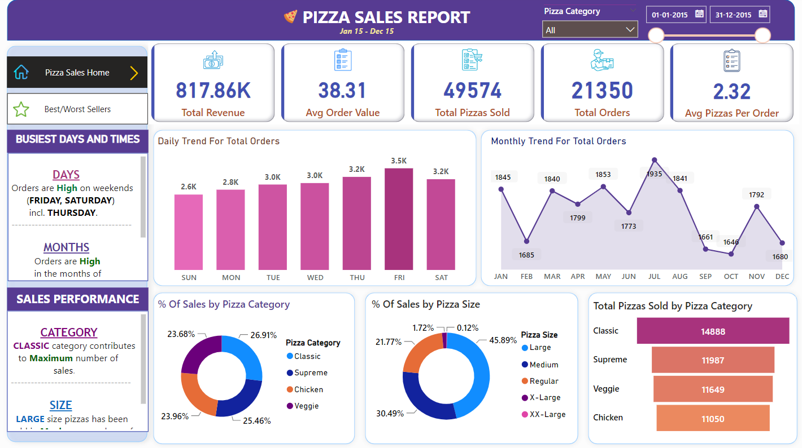
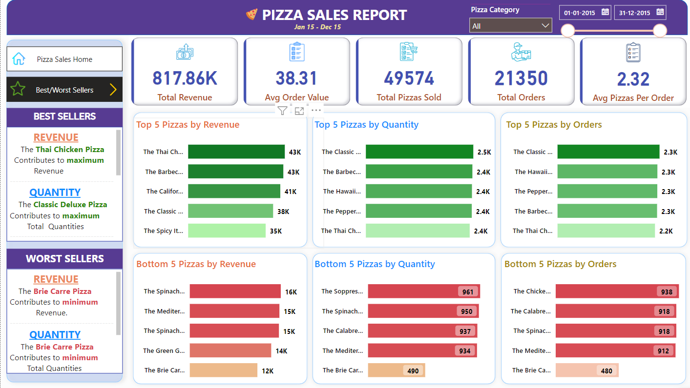

# Pizza Sales Report with SQL and Power BI

Welcome to the Pizza Sales Report project! Leveraging SQL for data analysis and Power BI for dynamic visualizations, this project offers insights into daily/monthly trends, pizza sales by category/size, and top-selling pizzas based on revenue, quantity, and total orders.

# :octocat:Dashboard👇

## Table of Contents
- Features
- Getting Started
- Data Analysis with SQL
- Creating Dashboards with Power BI
- Dashboard Overview
- How to Use the Dashboard
- Dashboard Images
- Contributors
- Feedback and Contributions

## Features
- Explore daily/monthly trends
- Analyze sales by category/size
- Identify top-selling pizzas

## Getting Started
#### Data Analysis with SQL
- Scripts and queries in `Sales_Queries.sql`
  
## Creating Dashboards with Power BI
- Dashboard images in `Dashboards` folder (PNG format)

## Drive Link to Datasets
- [Google Drive Link](https://drive.google.com/drive/folders/1q4biuKj2hR4Z1fRzKy0Jhr3ZDkBPlpYY?usp=sharing)

## Dashboard Overview
- Daily/Monthly Trends
- Pizza Category/Size Analysis
- Top/Least-Selling Pizzas

## How to Use the Dashboard
- Open `Dashboards` folder to view dashboard images
- Click on images to explore the dashboard snapshots

## Dashboard Images
To explore, 
- click the below link and
- click the rightmost option inverted triangle then 
- click "Open with..." option, 
- select "GitHub Dev," 

## Contributors
- Praveen M

## Feedback and Contributions
- Open issues or PRs for improvements
- Your contributions are valued!
